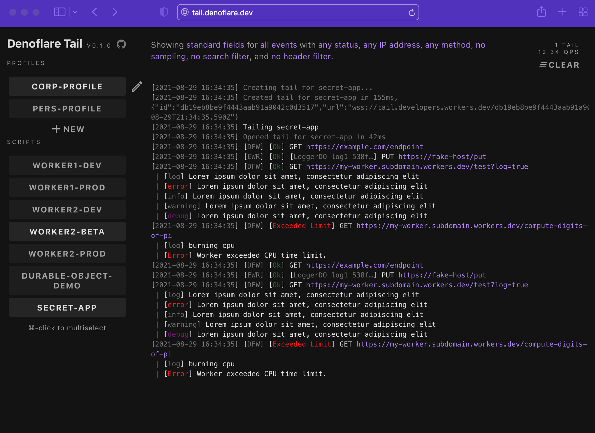

# Overview
Develop, test, and deploy [Cloudflare Workers](https://workers.cloudflare.com) with [Deno](https://deno.land)
## Powered by Denoflare
[tail.denoflare.dev · Watch live requests and logs for your Cloudflare Workers in the browser!](https://tail.denoflare.dev)



## Build env
```
HOME=$HOME
DENOFLARE_VERSION=$DENOFLARE_VERSION
DENO_VERSION=$DENO_VERSION
CF_PAGES=$CF_PAGES
CF_PAGES_BRANCH=$CF_PAGES_BRANCH
CF_PAGES_COMMIT_SHA=$CF_PAGES_COMMIT_SHA
```
